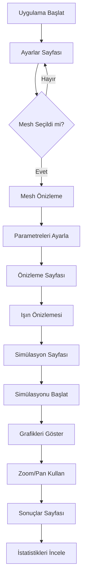
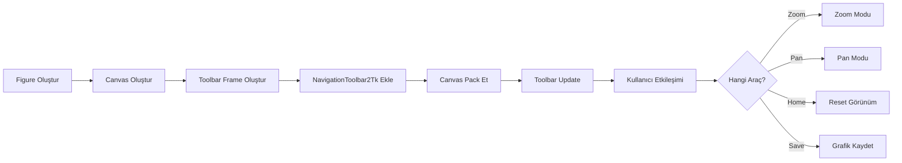
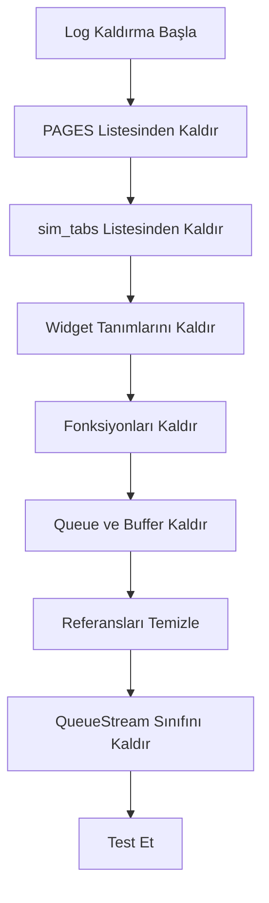

# Grafik Zoom ve Yardım Sayfası Geliştirme Planı

## 📋 Genel Bakış

Bu plan, simülasyon uygulamasına profesyonel grafik manipülasyon araçları eklemek ve kullanıcı deneyimini iyileştirmek için hazırlanmıştır.

## 🎯 Hedefler

1. **Grafik Zoom Özelliği**: Matplotlib'in NavigationToolbar2Tk araç çubuğunu ekleyerek profesyonel grafik manipülasyonu sağlamak
2. **Log Kaldırma**: Gereksiz log sekmelerini kaldırarak arayüzü sadeleştirmek
3. **Yardım Sayfası**: "Hakkında" sekmesini "Yardım" olarak değiştirip kullanım kılavuzu eklemek

## 📊 Mevcut Durum Analizi

### Grafik Yapısı
- **Önizleme Sayfası**: [`_render_preview()`](test.py:432) fonksiyonunda 3D grafik oluşturuluyor
- **Simülasyon Sayfası**: [`_embed_graph()`](test.py:1235) fonksiyonunda grafikler gösteriliyor
- **Mesh Önizleme**: [`_draw_mesh_mini()`](test.py:755) fonksiyonunda mini mesh görünümü var

### Log Yapısı
- **Ana Navigasyon**: [`PAGES`](test.py:97) listesinde "Log" sekmesi var (satır 102)
- **Simülasyon Sekmesi**: [`sim_tabs`](test.py:595) listesinde "Log" alt sekmesi var (satır 599)
- **Log Widget'ları**: 
  - [`self._log_box`](test.py:642) - Simülasyon sekmesindeki log
  - [`self._log_box2`](test.py:702) - Ana log sekmesindeki log
  - [`self._log_console_frame`](test.py:628) - Log konsol frame'i

### Hakkında Sayfası
- [`_build_page_hakkinda()`](test.py:711) fonksiyonunda teknik bilgiler gösteriliyor

## 🔧 Teknik Değişiklikler

### 1. NavigationToolbar2Tk Entegrasyonu

#### Import Eklemeleri
```python
from matplotlib.backends.backend_tkagg import FigureCanvasTkAgg, NavigationToolbar2Tk
```

#### Toolbar Ekleme Stratejisi
Her grafik canvas'ına toolbar eklenecek:

**Önizleme Sayfası** ([`_render_preview()`](test.py:432)):
```python
# Canvas oluşturulduktan sonra
canvas = FigureCanvasTkAgg(fig, master=self._preview_area)
canvas.draw()

# Toolbar için frame oluştur
toolbar_frame = ctk.CTkFrame(self._preview_area, fg_color=C["panel3"], height=40)
toolbar_frame.pack(side="bottom", fill="x", padx=4, pady=4)

# Toolbar ekle
toolbar = NavigationToolbar2Tk(canvas, toolbar_frame)
toolbar.update()

# Canvas'ı pack et
canvas.get_tk_widget().pack(side="top", fill="both", expand=True)
```

**Simülasyon Sayfası** ([`_embed_graph()`](test.py:1235)):
```python
# Toolbar için frame oluştur
if hasattr(self, '_sim_toolbar_frame'):
    self._sim_toolbar_frame.destroy()

self._sim_toolbar_frame = ctk.CTkFrame(
    self._sim_visual_area, fg_color=C["panel3"], height=40)
self._sim_toolbar_frame.pack(side="bottom", fill="x", padx=4, pady=4)

# Canvas ve toolbar oluştur
canvas = FigureCanvasTkAgg(fig, master=self._sim_visual_area)
toolbar = NavigationToolbar2Tk(canvas, self._sim_toolbar_frame)
toolbar.update()

canvas.draw()
canvas.get_tk_widget().pack(side="top", fill="both", expand=True)
```

**Mesh Önizleme** ([`_draw_mesh_mini()`](test.py:755)):
```python
# Mini mesh için de toolbar eklenebilir (opsiyonel)
```

#### Toolbar Stil Özelleştirme
```python
# Toolbar arka plan rengini özelleştir
toolbar.config(background=C["panel3"])
toolbar._message_label.config(background=C["panel3"], foreground=C["text"])

# Butonları özelleştir (opsiyonel)
for button in toolbar.winfo_children():
    if isinstance(button, tk.Button):
        button.config(bg=C["panel2"], fg=C["text"], 
                     activebackground=C["border2"])
```

### 2. Log Kaldırma İşlemleri

#### Değiştirilecek Dosyalar ve Satırlar

**[`test.py`](test.py:1)**

1. **PAGES Listesi** (satır 97-104):
```python
# ÖNCESİ:
PAGES = [
    ("⚙",  "Ayarlar"),
    ("👁",  "Önizleme"),
    ("▶",  "Simülasyon"),
    ("📊", "Sonuçlar"),
    ("📋", "Log"),        # ← KALDIRILACAK
    ("ℹ",  "Hakkında"),
]

# SONRASI:
PAGES = [
    ("⚙",  "Ayarlar"),
    ("👁",  "Önizleme"),
    ("▶",  "Simülasyon"),
    ("📊", "Sonuçlar"),
    ("❓", "Yardım"),     # ← YENİ
]
```

2. **Simülasyon Sekmeleri** (satır 595-600):
```python
# ÖNCESİ:
sim_tabs = [
    ("📊", "Üçgen Işın"),
    ("📈", "Histogram"),
    ("💻", "CPU/RAM"),
    ("📋", "Log")         # ← KALDIRILACAK
]

# SONRASI:
sim_tabs = [
    ("📊", "Üçgen Işın"),
    ("📈", "Histogram"),
    ("💻", "CPU/RAM")
]
```

3. **Log Widget'ları Kaldırma**:
   - [`self._log_box`](test.py:642) tanımını kaldır
   - [`self._log_box2`](test.py:702) tanımını kaldır
   - [`self._log_console_frame`](test.py:628) tanımını kaldır
   - [`_build_page_log()`](test.py:691) fonksiyonunu kaldır
   - [`_clear_log()`](test.py:1029) fonksiyonunu kaldır
   - [`_append_log()`](test.py:1002) fonksiyonunu kaldır
   - [`_flush_log_buffer()`](test.py:1009) fonksiyonunu kaldır

4. **Log Buffer Değişkenleri** (satır 158-159):
```python
# KALDIRILACAK:
self._log_buffer = []
self._log_update_pending = False
```

5. **Log Queue** (satır 116):
```python
# KALDIRILACAK:
self._log_queue = queue.Queue()
```

6. **Polling Fonksiyonu** (satır 995-1000):
```python
# ÖNCESİ:
def _poll(self):
    while not self._log_queue.empty():
        self._append_log(self._log_queue.get_nowait())
    while not self._result_queue.empty():
        self._apply_results(self._result_queue.get_nowait())
    self.after(80, self._poll)

# SONRASI:
def _poll(self):
    while not self._result_queue.empty():
        self._apply_results(self._result_queue.get_nowait())
    self.after(80, self._poll)
```

7. **Simülasyon Worker** (satır 874-954):
```python
# ÖNCESİ:
def _sim_worker(self, params):
    old = sys.stdout
    sys.stdout = QueueStream(self._log_queue)  # ← KALDIRILACAK
    try:
        # ... simülasyon kodu ...
    finally:
        sys.stdout = old  # ← KALDIRILACAK

# SONRASI:
def _sim_worker(self, params):
    try:
        # ... simülasyon kodu ...
        # stdout yönlendirmesi kaldırıldı
    except Exception as e:
        import traceback
        print(f"\n[HATA] {e}\n{traceback.format_exc()}")
        self.after(0, lambda: self._sim_finished())
```

8. **QueueStream Sınıfı** (satır 58-62):
```python
# TAMAMEN KALDIRILACAK:
class QueueStream:
    def __init__(self, q): self.q = q
    def write(self, t):
        if t: self.q.put(t)
    def flush(self): pass
```

9. **Log Referansları**:
   - [`_start_simulation()`](test.py:805) içindeki `self._append_log()` çağrılarını kaldır (satır 821, 825)
   - [`_stop_simulation()`](test.py:857) içindeki `self._append_log()` çağrısını kaldır (satır 859)
   - [`_clear_log()`](test.py:833) çağrısını kaldır

10. **Alt Seçenek Kontrolü** (satır 1067-1074):
```python
# ÖNCESİ:
def _build_sub_options(self, tab_name):
    # ...
    if tab_name == "Log":
        self._sub_option_container.pack_forget()
        self._log_console_frame.pack(fill="both", expand=True, padx=0, pady=0)
        return
    # ...

# SONRASI:
def _build_sub_options(self, tab_name):
    # ... Log kontrolü tamamen kaldırılacak
    # Sadece diğer sekmeler için alt seçenekler gösterilecek
```

### 3. Yardım Sayfası Oluşturma

#### Sayfa Yapısı
```python
def _build_page_yardim(self):
    """Kullanım kılavuzu sayfası"""
    page = self._pages["Yardım"]
    
    # Scrollable frame
    scroll = ctk.CTkScrollableFrame(
        page, fg_color=C["bg"],
        scrollbar_button_color=C["border"],
        scrollbar_button_hover_color=C["accent"])
    scroll.pack(fill="both", expand=True, padx=20, pady=20)
    
    # Başlık
    _lbl(scroll, "📖  Kullanım Kılavuzu", size=18, weight="bold",
         color=C["accent"]).pack(anchor="w", pady=(0, 20))
    
    # Bölümler
    self._add_help_section(scroll, "1️⃣ Başlangıç", [
        "• Uygulamayı başlattığınızda Ayarlar sayfası açılır",
        "• Mesh dosyanızı seçin (UNV formatı)",
        "• Işın kaynağı tipini belirleyin (Noktasal/Paralel)"
    ])
    
    self._add_help_section(scroll, "2️⃣ Parametre Ayarları", [
        "• Theta (Dikey Açı): Işınların dikey yayılım açısı",
        "• Phi (Yatay Açı): Işınların yatay yayılım açısı",
        "• Adım Sayısı: Her açı için kaç ışın oluşturulacağı",
        "• Maks Sekme: Işınların maksimum yansıma sayısı"
    ])
    
    # ... diğer bölümler
```

#### İçerik Bölümleri

1. **Başlangıç**
   - Uygulama açılışı
   - Mesh dosyası seçimi
   - Temel ayarlar

2. **Parametre Ayarları**
   - Theta ve Phi açıları
   - Adım sayısı
   - Maksimum sekme sayısı
   - Işın kaynağı tipleri

3. **Önizleme**
   - Işın önizlemesi nasıl görüntülenir
   - Kamera açısı ayarları
   - Mesh önizlemesi

4. **Simülasyon**
   - Simülasyon başlatma
   - Grafik görünümleri
   - Zoom ve pan kullanımı
   - Grafik kaydetme

5. **Sonuçlar**
   - İstatistiklerin yorumlanması
   - Performans metrikleri
   - Açı analizleri

6. **Grafik Araçları**
   - 🏠 Home: Orijinal görünüme dön
   - ← → : İleri/geri git
   - ⊕ : Pan/hareket ettir
   - 🔍 : Zoom yap
   - 💾 : Grafiği kaydet
   - ⚙ : Alt grafik ayarları

## 📐 Mermaid Diyagramları

### Uygulama Akış Şeması



### Grafik Toolbar Entegrasyonu



### Log Kaldırma İşlem Akışı



## 🎨 UI Değişiklikleri

### Önce ve Sonra

#### Ana Navigasyon
```
ÖNCESİ:  ⚙ Ayarlar | 👁 Önizleme | ▶ Simülasyon | 📊 Sonuçlar | 📋 Log | ℹ Hakkında
SONRASI: ⚙ Ayarlar | 👁 Önizleme | ▶ Simülasyon | 📊 Sonuçlar | ❓ Yardım
```

#### Simülasyon Sekmeleri
```
ÖNCESİ:  📊 Üçgen Işın | 📈 Histogram | 💻 CPU/RAM | 📋 Log
SONRASI: 📊 Üçgen Işın | 📈 Histogram | 💻 CPU/RAM
```

#### Grafik Alanı
```
ÖNCESİ:
┌─────────────────────────────┐
│      Grafik Alanı           │
│                             │
│                             │
└─────────────────────────────┘

SONRASI:
┌─────────────────────────────┐
│      Grafik Alanı           │
│                             │
│                             │
├─────────────────────────────┤
│ 🏠 ← → ⊕ 🔍 💾 ⚙          │ ← Toolbar
└─────────────────────────────┘
```

## 🔍 Test Senaryoları

### 1. Grafik Zoom Testi
- [ ] Önizleme sayfasında toolbar görünüyor mu?
- [ ] Simülasyon grafiklerinde toolbar görünüyor mu?
- [ ] Zoom butonu çalışıyor mu?
- [ ] Pan butonu çalışıyor mu?
- [ ] Home butonu orijinal görünüme dönüyor mu?
- [ ] Save butonu grafiği kaydediyor mu?
- [ ] Toolbar renkleri tema ile uyumlu mu?

### 2. Log Kaldırma Testi
- [ ] Ana navigasyonda Log sekmesi yok mu?
- [ ] Simülasyon sekmelerinde Log yok mu?
- [ ] Simülasyon çalışırken hata oluşuyor mu?
- [ ] Console'da log çıktıları görünüyor mu? (terminal'de)
- [ ] Bellek sızıntısı var mı?

### 3. Yardım Sayfası Testi
- [ ] Yardım sekmesi görünüyor mu?
- [ ] İçerik okunabilir mi?
- [ ] Scroll çalışıyor mu?
- [ ] Bölümler düzgün formatlanmış mı?
- [ ] Renkler tema ile uyumlu mu?

## 📝 Uygulama Adımları

### Adım 1: Import Güncellemeleri
```python
# test.py başına ekle
from matplotlib.backends.backend_tkagg import FigureCanvasTkAgg, NavigationToolbar2Tk
```

### Adım 2: PAGES Listesi Güncelleme
- Log satırını kaldır
- Hakkında'yı Yardım olarak değiştir

### Adım 3: Log Yapılarını Kaldır
- QueueStream sınıfını kaldır
- Log widget'larını kaldır
- Log fonksiyonlarını kaldır
- Log referanslarını temizle

### Adım 4: Toolbar Entegrasyonu
- `_render_preview()` fonksiyonunu güncelle
- `_embed_graph()` fonksiyonunu güncelle
- Toolbar stil özelleştirmesi ekle

### Adım 5: Yardım Sayfası Oluştur
- `_build_page_yardim()` fonksiyonu ekle
- `_add_help_section()` yardımcı fonksiyonu ekle
- İçerik bölümlerini doldur

### Adım 6: Test ve Doğrulama
- Tüm test senaryolarını çalıştır
- Hata kontrolü yap
- Performans testi yap

## ⚠️ Dikkat Edilmesi Gerekenler

1. **Toolbar Renkleri**: CustomTkinter dark tema ile uyumlu olmalı
2. **Bellek Yönetimi**: Eski toolbar'lar destroy edilmeli
3. **Thread Safety**: Toolbar UI thread'inde oluşturulmalı
4. **Geriye Dönük Uyumluluk**: Mevcut grafikler bozulmamalı
5. **Performans**: Toolbar ekleme grafik render süresini artırmamalı

## 🚀 Beklenen Sonuçlar

### Kullanıcı Deneyimi
- ✅ Profesyonel grafik manipülasyon araçları
- ✅ Daha temiz ve sade arayüz
- ✅ Kapsamlı kullanım kılavuzu
- ✅ Daha iyi keşfedilebilirlik

### Teknik İyileştirmeler
- ✅ Standart Matplotlib araçları
- ✅ Daha az kod karmaşıklığı
- ✅ Daha iyi bakım edilebilirlik
- ✅ Azaltılmış bellek kullanımı

## 📚 Referanslar

- [Matplotlib NavigationToolbar2Tk Dokümantasyonu](https://matplotlib.org/stable/api/backend_tk_api.html)
- [CustomTkinter Dokümantasyonu](https://customtkinter.tomschimansky.com/)
- [Tkinter Best Practices](https://tkdocs.com/tutorial/)

---

**Plan Durumu**: ✅ Tamamlandı  
**Oluşturulma Tarihi**: 2026-05-15  
**Son Güncelleme**: 2026-05-15
