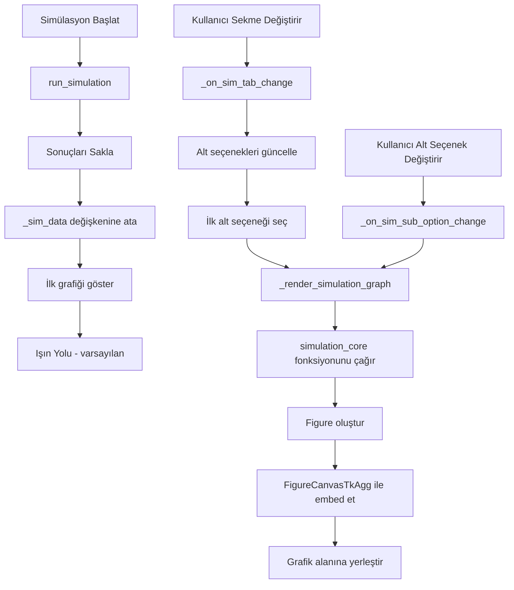

# Simülasyon Sekmesi Yeniden Tasarım Planı

## 📋 Genel Bakış

Simülasyon sekmesinde grafiklerin arayüz içinde gösterilmesi ve kullanıcı dostu bir sekme sistemi ile farklı görünümlerin sunulması.

---

## 🎯 Hedefler

1. ✅ Grafiklerin ayrı pencerede değil, arayüz içinde gösterilmesi
2. ✅ Kullanıcının farklı grafik türlerini seçebilmesi
3. ✅ İnteraktif log konsolu (240k kayıt için scroll destekli)
4. ✅ Modern ve kullanıcı dostu tasarım

---

## 🏗️ Yeni Simülasyon Sekmesi Yapısı

```
┌─────────────────────────────────────────────────────────────┐
│  ▶ Simülasyonu Başlat  [⏹ Durdur]  [Progress Bar]          │
├─────────────────────────────────────────────────────────────┤
│                                                             │
│                  BÜYÜK GRAFİK ALANI                         │
│              (Seçilen grafik burada gösterilir)             │
│                                                             │
│                                                             │
├─────────────────────────────────────────────────────────────┤
│ [📊 Üçgen Işın] [📈 Histogram] [💻 CPU/RAM] [📋 Log]       │
├─────────────────────────────────────────────────────────────┤
│  Alt Seçenekler (Seçilen sekmeye göre değişir):            │
│  • Üçgen Işın: [Işın Yolu] [Isı Haritası] [Işın İzi]       │
│  • Histogram: [Gelme Açısı] [Sekme Açısı]                  │
│  • CPU/RAM: [CPU Kullanımı] [RAM Kullanımı]                │
│  • Log: [Konsol çıktısı - scroll destekli]                 │
└─────────────────────────────────────────────────────────────┘
```

---

## 📊 Grafik Türleri ve Açıklamaları

### 1️⃣ Üçgen Işın Grafikleri

#### A. Işın Yolu Görünümü
- **Açıklama**: Sadece ışınların yolları gösterilir
- **Özellikler**:
  - Üçgenler boyanmaz (gri/transparan)
  - Işın yolları renkli çizgiler olarak gösterilir
  - Kaynak nokta vurgulanır
  - 3D görünüm (kamera açısı ayarlanabilir)

#### B. Isı Haritası Görünümü
- **Açıklama**: Üçgenler çarpma sayısına göre renklendirilir
- **Özellikler**:
  - Işınlar gösterilmez
  - Renk paleti (colorbar) ile çarpma yoğunluğu gösterilir
  - Jet veya viridis renk haritası
  - 3D görünüm

#### C. Işın İzi Görünümü
- **Açıklama**: Işınların el feneri gibi hangi yöne gittiğini gösterir
- **Özellikler**:
  - Işınların yönü ok veya konik şekiller ile gösterilir
  - Yoğunluk haritası ile birleştirilebilir
  - Animasyon benzeri görünüm (statik)
  - 3D görünüm

### 2️⃣ Histogram Grafikleri

#### A. Gelme Açısı Histogramı
- **Açıklama**: Işınların üçgenlere gelme açılarının dağılımı
- **Özellikler**:
  - X ekseni: Açı (0°-90°)
  - Y ekseni: Üçgen sayısı
  - Ortalama ve medyan çizgileri
  - 0° = Dik çarpış, 90° = Sıyırma

#### B. Sekme Açısı Histogramı
- **Açıklama**: Her sekmedeki açı değişimlerinin dağılımı
- **Özellikler**:
  - X ekseni: Sekme numarası
  - Y ekseni: Ortalama açı
  - Her sekme için ayrı bar
  - Trend çizgisi

### 3️⃣ CPU/RAM Grafikleri

#### A. CPU Kullanım Grafiği
- **Açıklama**: Simülasyon süresince CPU kullanımı
- **Özellikler**:
  - X ekseni: Zaman (saniye)
  - Y ekseni: CPU kullanımı (%)
  - Ortalama ve maksimum çizgileri
  - Alan grafiği (fill_between)

#### B. RAM Kullanım Grafiği
- **Açıklama**: Simülasyon süresince RAM kullanımı
- **Özellikler**:
  - X ekseni: Zaman (saniye)
  - Y ekseni: RAM kullanımı (GB)
  - Ortalama ve maksimum çizgileri
  - Alan grafiği (fill_between)

### 4️⃣ Log Konsolu
- **Açıklama**: Simülasyon çıktılarının gösterildiği alan
- **Özellikler**:
  - Scroll destekli textbox
  - 240k kayıt için optimize edilmiş
  - Monospace font
  - Temizle butonu
  - Otomatik scroll (en son satıra)

---

## 🔧 Teknik Uygulama Detayları

### Dosya Yapısı

```
test.py (GUI)
├── _build_page_simulasyon()
│   ├── Üst toolbar (Başlat/Durdur/Progress)
│   ├── Grafik görüntüleme alanı
│   ├── Alt sekme çubuğu
│   └── Alt seçenek butonları
│
├── _render_simulation_graph(graph_type, sub_option)
│   └── Seçilen grafiği oluştur ve embed et
│
└── _update_simulation_view()
    └── Sekme değişiminde grafiği güncelle

simulation_core.py
├── create_ray_path_figure()      → Işın Yolu
├── create_heatmap_figure()       → Isı Haritası
├── create_ray_trace_figure()     → Işın İzi
├── create_angle_histogram()      → Gelme Açısı
├── create_bounce_histogram()     → Sekme Açısı
├── create_cpu_graph()            → CPU Kullanımı
└── create_ram_graph()            → RAM Kullanımı
```

### Değişiklikler

#### 1. [`test.py`](test.py) Değişiklikleri

**Yeni değişkenler ekle:**
```python
self._current_sim_tab = tk.StringVar(value="Üçgen Işın")
self._current_sub_option = tk.StringVar(value="Işın Yolu")
self._sim_data = None  # Simülasyon sonuçlarını sakla
```

**[`_build_page_simulasyon()`](test.py:531) fonksiyonunu yeniden yaz:**
- Üst toolbar (mevcut)
- Ortada büyük grafik alanı (yeni)
- Alt sekme çubuğu (yeni)
- Alt seçenek butonları (yeni)

**Yeni fonksiyonlar ekle:**
```python
def _on_sim_tab_change(self, tab_name):
    # Sekme değiştiğinde alt seçenekleri güncelle
    # İlk alt seçeneği otomatik seç
    # Grafiği güncelle

def _on_sim_sub_option_change(self, option_name):
    # Alt seçenek değiştiğinde grafiği güncelle

def _render_simulation_graph(self):
    # Mevcut sekme ve alt seçeneğe göre grafiği oluştur
    # simulation_core'dan ilgili fonksiyonu çağır
    # FigureCanvasTkAgg ile embed et
```

#### 2. [`simulation_core.py`](simulation_core.py) Değişiklikleri

**[`visualize()`](simulation_core.py:350) fonksiyonunu kaldır veya yeniden adlandır**

**Yeni fonksiyonlar ekle:**

```python
def create_ray_path_figure(A, B, C, bounce_paths, origin, 
                           cam_elev=20, cam_azim=45, 
                           bg_color="#0E1420"):
    """Işın yollarını gösteren 3D figure oluştur"""
    fig = plt.Figure(figsize=(10, 8), facecolor=bg_color)
    ax = fig.add_subplot(111, projection='3d')
    # Üçgenleri transparan göster
    # Işın yollarını çiz
    # Kaynak noktayı vurgula
    return fig

def create_heatmap_figure(A, B, C, hit_counts, 
                          cam_elev=20, cam_azim=45,
                          bg_color="#0E1420"):
    """Isı haritası figure oluştur"""
    fig = plt.Figure(figsize=(10, 8), facecolor=bg_color)
    ax = fig.add_subplot(111, projection='3d')
    # Üçgenleri çarpma sayısına göre renklendir
    # Colorbar ekle
    return fig

def create_ray_trace_figure(A, B, C, bounce_paths, hit_counts,
                            cam_elev=20, cam_azim=45,
                            bg_color="#0E1420"):
    """Işın izi figure oluştur"""
    fig = plt.Figure(figsize=(10, 8), facecolor=bg_color)
    ax = fig.add_subplot(111, projection='3d')
    # Işınların yönünü ok/konik şekiller ile göster
    # Yoğunluk ile birleştir
    return fig

def create_angle_histogram(avg_angles, hit_counts,
                          bg_color="#0E1420"):
    """Gelme açısı histogramı oluştur"""
    fig = plt.Figure(figsize=(10, 6), facecolor=bg_color)
    ax = fig.add_subplot(111)
    # Histogram çiz
    # Ortalama ve medyan çizgileri ekle
    return fig

def create_bounce_histogram(bounce_paths, avg_angles,
                           bg_color="#0E1420"):
    """Sekme açısı histogramı oluştur"""
    fig = plt.Figure(figsize=(10, 6), facecolor=bg_color)
    ax = fig.add_subplot(111)
    # Her sekme için ortalama açıyı hesapla
    # Bar chart oluştur
    return fig

def create_cpu_graph(resource_data, bg_color="#0E1420"):
    """CPU kullanım grafiği oluştur"""
    fig = plt.Figure(figsize=(10, 6), facecolor=bg_color)
    ax = fig.add_subplot(111)
    # CPU verilerini çiz
    # Ortalama ve maksimum çizgileri ekle
    return fig

def create_ram_graph(resource_data, bg_color="#0E1420"):
    """RAM kullanım grafiği oluştur"""
    fig = plt.Figure(figsize=(10, 6), facecolor=bg_color)
    ax = fig.add_subplot(111)
    # RAM verilerini çiz
    # Ortalama ve maksimum çizgileri ekle
    return fig
```

---

## 🎨 UI/UX Detayları

### Renk Paleti (Mevcut tema ile uyumlu)

```python
# Sekme renkleri
TAB_ACTIVE = "#4D9EFF"      # Aktif sekme
TAB_INACTIVE = "#5A7399"    # Pasif sekme
TAB_HOVER = "#8AAAD0"       # Hover durumu

# Alt seçenek buton renkleri
SUB_ACTIVE = "#1A3A6E"      # Aktif alt seçenek
SUB_INACTIVE = "#131A27"    # Pasif alt seçenek
SUB_HOVER = "#1A2233"       # Hover durumu
```

### Layout Oranları

```python
# Grafik alanı: %70 yükseklik
# Alt sekme + seçenekler: %30 yükseklik

# Sekme çubuğu yüksekliği: 50px
# Alt seçenek butonları yüksekliği: 40px
# Log konsolu (Log sekmesinde): Kalan alan
```

### Animasyonlar

- Sekme değişiminde yumuşak geçiş (fade)
- Grafik yüklenirken loading indicator
- Buton hover efektleri

---

## 🔄 Veri Akışı



---

## ✅ Uygulama Adımları

### Faz 1: Temel Yapı
1. [`_build_page_simulasyon()`](test.py:531) fonksiyonunu yeniden yaz
2. Grafik görüntüleme alanını oluştur
3. Alt sekme sistemini kur
4. Alt seçenek butonlarını ekle

### Faz 2: Grafik Fonksiyonları
5. [`simulation_core.py`](simulation_core.py) içinde yeni grafik fonksiyonlarını yaz
6. Her grafik türü için ayrı Figure döndüren fonksiyonlar
7. Renk paleti ve stil ayarları

### Faz 3: Entegrasyon
8. [`_render_simulation_graph()`](test.py) fonksiyonunu yaz
9. Sekme değişim mantığını kur
10. FigureCanvasTkAgg ile embed işlemi

### Faz 4: İyileştirmeler
11. Log konsolu için scroll optimizasyonu
12. Loading indicator ekle
13. Hata yönetimi
14. Test ve ince ayarlar

---

## 🧪 Test Senaryoları

1. ✅ Simülasyon başlatıldığında varsayılan grafik gösterilmeli
2. ✅ Sekme değiştirildiğinde ilgili alt seçenekler görünmeli
3. ✅ Alt seçenek değiştirildiğinde grafik güncellenmeli
4. ✅ Log konsolu 240k satır için sorunsuz çalışmalı
5. ✅ Grafik yüklenirken UI donmamalı
6. ✅ Simülasyon durdurulduğunda grafikler korunmalı
7. ✅ Kamera açıları ayarları grafiklere yansımalı

---

## 📝 Notlar

- Mevcut [`visualize()`](simulation_core.py:350) fonksiyonu `plt.show()` kullanıyor, bu kaldırılacak
- Tüm grafikler Figure objesi olarak döndürülecek
- GUI thread'inde grafik oluşturma işlemi yapılacak
- Büyük veri setleri için downsampling uygulanabilir
- Grafik stilleri mevcut tema ile uyumlu olacak

---

## 🎯 Beklenen Sonuç

Kullanıcı simülasyonu başlattığında:
1. Grafik arayüz içinde gösterilir (ayrı pencere açılmaz)
2. Varsayılan olarak "Işın Yolu" görünümü gösterilir
3. Alt sekmelerden farklı görünümler seçilebilir
4. Her görünüm için özel grafik oluşturulur
5. Log konsolu interaktif ve scroll desteklidir
6. Modern ve kullanıcı dostu bir deneyim sunar

---

## 📚 Referanslar

- Mevcut kod: [`test.py`](test.py), [`simulation_core.py`](simulation_core.py)
- Matplotlib FigureCanvasTkAgg: Grafik embedding için
- CustomTkinter: Modern UI bileşenleri için
- Tasarım referansı: Kullanıcının sağladığı çizim
